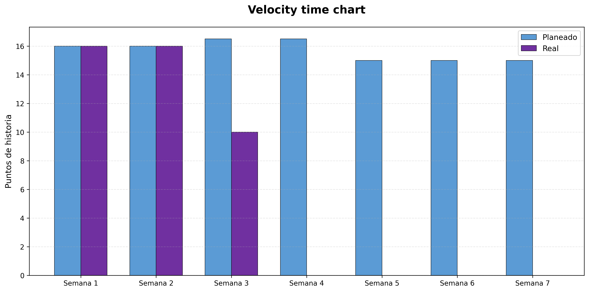
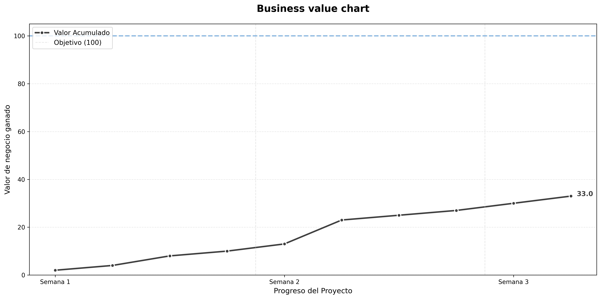
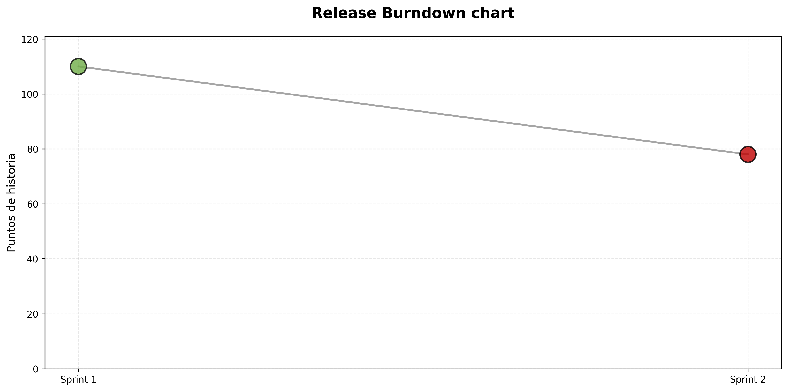

# Gráficas del proyecto no generadas por Jira - Proyecto Final MISO 202520 G2

**Última actualización:** 2025-10-11 13:09:50 UTC

## Resumen de métricas del proyecto

### Business value chart
- **Valor total:** 4.0 / 100 puntos (4%)
- **Historias completadas:** 2
- **Valor restante:** 96.0 puntos

### Velocity chart
- **Semanas registradas:** 7
- **Total planeado:** 110.0 puntos de historia
- **Total completado:** 6.0 puntos de historia
- **Velocidad promedio:** 0.9 puntos/semana

### Release burndown chart
- **Alcance inicial:** 110 puntos de historia
- **Restante:** 110 puntos de historia
- **Completado:** 0 puntos de historia
- **Sprints registrados:** 1

---

## Velocity time chart

Compara los puntos de historia planeados vs completados por semana.



**Información clave:**
- Muestra el rendimiento semanal comparando la entrega planeada vs real
- Ayuda a identificar la capacidad del equipo y la precisión de la planeación
- Las barras moradas indican los puntos realmente entregados

---

## Gráfica de valor de negocio

Valor de negocio acumulado entregado a lo largo del tiempo (objetivo: 100 puntos).



**Información clave:**
- Cada punto representa una historia completada
- La línea muestra el progreso acumulado hacia los 100 puntos totales
- Las líneas verticales punteadas separan las semanas

---

## Release burndown chart

Puntos de historia restantes al inicio de cada sprint vs burndown ideal.



**Información clave:**
- Puntos verdes: puntos restantes al inicio del sprint
- Línea gris: trayectoria seguida

---

## Historias completadas


### Semana 1

- **HUP-001** - 2025-10-11
- **HUP-005** - 2025-10-11


---

## Cómo actualizar

Este reporte se genera automáticamente cuando haces push a las ramas `develop` o `main`.

Para actualizar las gráficas:

1. Edita los archivos de datos en `scripts-entregas/data/`:
   - `completed_stories.csv` - Agrega historias completadas con fechas
   - `velocity_data.csv` - Actualiza los datos de velocidad semanales
   - `release_burndown_data.csv` - Actualiza los datos de burndown por sprint

2. Haz push a `develop` o `main`:
   ```bash
   git add scripts-entregas/data/
   git commit -m "actualizar: agregar historias completadas"
   git push
   ```

3. GitHub Actions automáticamente:
   - Calculará el valor de negocio
   - Generará todas las gráficas
   - Actualizará este reporte
   - Hará commit de los cambios al repositorio


---

## Archivos de datos

- **Historias completadas:** [`data/completed_stories.csv`](data/completed_stories.csv)
- **Valores de negocio por historia:** [`data/story_business_values.csv`](data/story_business_values.csv)
- **Datos de velocidad:** [`data/velocity_data.csv`](data/velocity_data.csv)
- **Burndown del release:** [`data/release_burndown_data.csv`](data/release_burndown_data.csv)

---

*Generado automáticamente por GitHub Actions*
